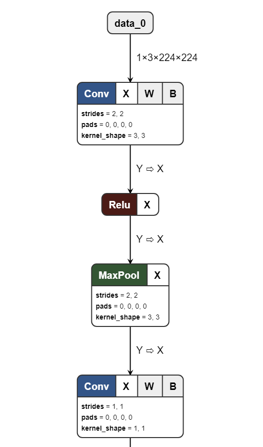
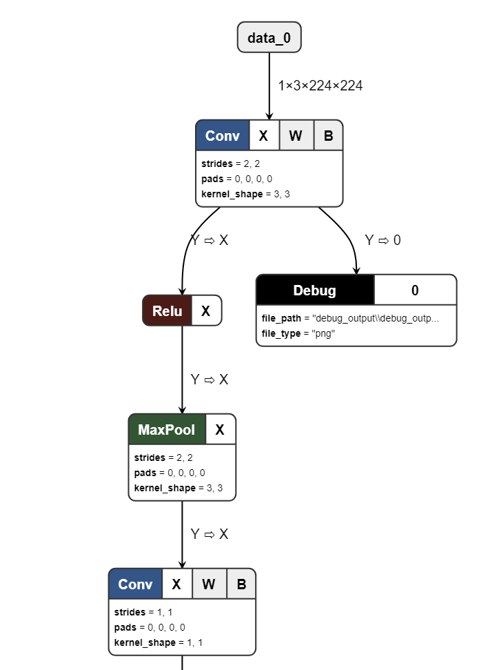

# Debugging Your Model

Debugging inference on your onnx model can be useful for, but is not limited to the following use cases:

1. Gain insight into how raw data is flowing through an operator in your model.
2. Compare execution results on different hardware (CPU vs GPU).
3. Visualize intermediate data for Computer Vision inference.

## The Debug Operator
Gaining access to intermediate data as it flows through your model during inference is achieved using a custom "Debug" operator. This operator is intended to be added into your model and consume a specific intermediate output as its input. It is further configurable with two additional attributes:
1. file_type: [png|text] The format to export intermediate outputs.

	a) 'png' will interpret and export intermediate output as an image and requires tensor data in NCHW format. This is useful for computer vision scenarios where you seek to gain additional visual insight as to how features are being extracted through a model.

	b) 'text' will output raw tensor data in human readable format.
2. file_path: The file path to export intermediate outputs. Note that the parent directory of this file must exist. 
		It is recommended for png debug operators consuming tensor data with many channels to output to its own directory since a png will be created for each channel.

## How to use the Debug Operator
The debug operator is planned be added to a future release of onnx runtime, but until then you will need to compile custom operator code into your app.
1. Compile [debug_cpu.cpp](operators/debug_cpu.cpp) and [debug_cpu.h](operators/debug_cpu.h) into your project.
2. Compile [customoperatorprovider.h](operators/customoperatorprovider.h) into your project but first modify the RegisterSchemas and RegisterKernels subroutines by removing any non DebugOperatorFactory functions remove the include statements for relu_cpu.h and noisyrelu_cpu.h.
3. When you initialize your LearningModel, pass in a custom provider like so:
```
 auto customOperatorProvider = winrt::make<CustomOperatorProvider>();
 auto provider = customOperatorProvider.as<ILearningModelOperatorProvider>();
 auto model = LearningModel::LoadFromFilePath(modelPath, provider);
```
4. Modify your input graph to include the Debug Operator as using [debug_single_output.py] (../../customize_model/debug_single_output.py) or your own custom method. This script will insert a debug operator into the provided onnx model. Configuration of the debug operator is specified via command line arguments:
```
usage: debug_single_output.py [-h] --model_path MODEL_PATH --modified_path
                              MODIFIED_PATH --debug_file_type {png,text}
                              --debug_file_path DEBUG_FILE_PATH
                              --intermediate_output INTERMEDIATE_OUTPUT
```

Here is a netron visualization SqueezeNet's first section before and after inserting a debug operator consuming the output after the convolution:

